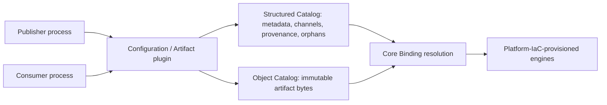
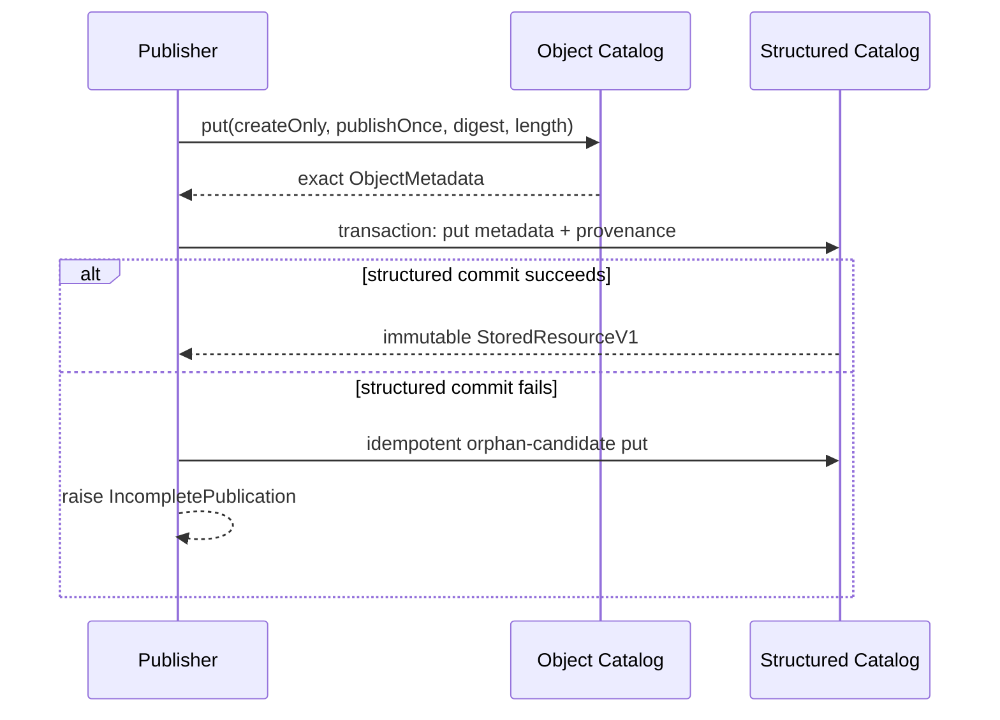

# Architecture

## Boundary

The package owns two profiles inside one library distribution. It does not add to the V1 Catalog
registry. Its only data-plane dependencies are the released structured and object Catalog public
surfaces.

Core alone normalizes mapping-first Expressions into serialized Operations and selects a Binding.
This library has no Adapter, Engine, provider SDK, credential, or physical-locator concept.

## Resource model

A logical identity is `(namespace, kind, name, version)` and deterministically maps to `resourceId`.
The identity is immutable across both profiles.

- Configuration: canonical JSON payload, exact `PayloadSchemaRef`, digest, length, provenance, and
  lifecycle metadata are one structured record.
- Artifact: structured metadata contains an exact digest-bearing `ObjectReference`; bytes exist
  only in the object Resource at `artifacts/<resourceId>`.
- Channel: an append-only sequence of deterministic channel-version rows. Inserting the next row
  and comparing the returned target implements provider-neutral compare-and-set without a cache or
  new Catalog.

`DRAFT`, `PUBLISHED`, and `DEPRECATED` are the public lifecycle states. Publisher conveniences
create immutable `PUBLISHED` versions directly. A published or deprecated version cannot be
deleted through this package.

The locked direct surfaces are `store.configurations` and `store.artifacts`. Each combines its
profile-specific publisher and consumer conveniences, while `store.publisher` and `store.consumer`
allow build and runtime code to depend on separated library surfaces. A `PublicationReceipt.ref`
is accepted directly by the profile-specific compare-and-set `promote` method.

## Artifact publication state

An Object conflict is idempotent only when stat proves the same logical Object, digest, byte length,
media type, and Object Resource. Metadata conflicts are idempotent only when all immutable
publication fields agree.

## Locked baseline

The 1.0.0 contracts target HLD revision 56, Catalogs/Public Interfaces revision 70, Engine Adapters
revision 24, Kafka Streaming LLD revision 6, MeridianConstructs revision 45, and Configuration and
Artifact LLD revision 24. Query/projection/telemetry/audit/lineage/usage/cost remain capabilities or
data, not Catalogs; NativeQuery is outside V1.
